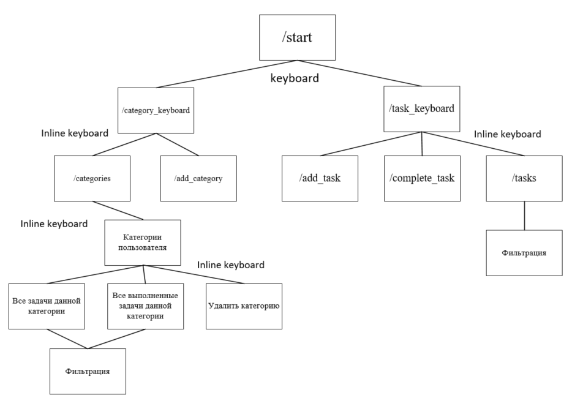

## Описание

Plan_time_bot - это telegram-bot, который представляет собой task-manager, позволяющий
создавать задачи, указывая её категория, дату и timeshift.

Предполагаемый функционал:
1. Планирование задач;
2. Введение истории задач;
3. Выдача истории задач по определенным фильтрам(возможно с графиками);
4. Оповещение о текущих задачах на сегодня.

## Инструменты

- aiogram;
- async sqlalchemy (postgresql);
- alembic;
- docker и docker-compose.

## База данных

| Таблица      | Описание                                                                                                                                                      |
|--------------|---------------------------------------------------------------------------------------------------------------------------------------------------------------|
| category     | Категории задач                                                                                                                                               |
| task_сompleted | Все выполненные запланированные задачи                                                                                                                        |
| task         | Все запланированные задачи                                                                                                                                    |
| user         | Все пользователи, пользующиеся ботом                                                                                                                          |

## Схема

